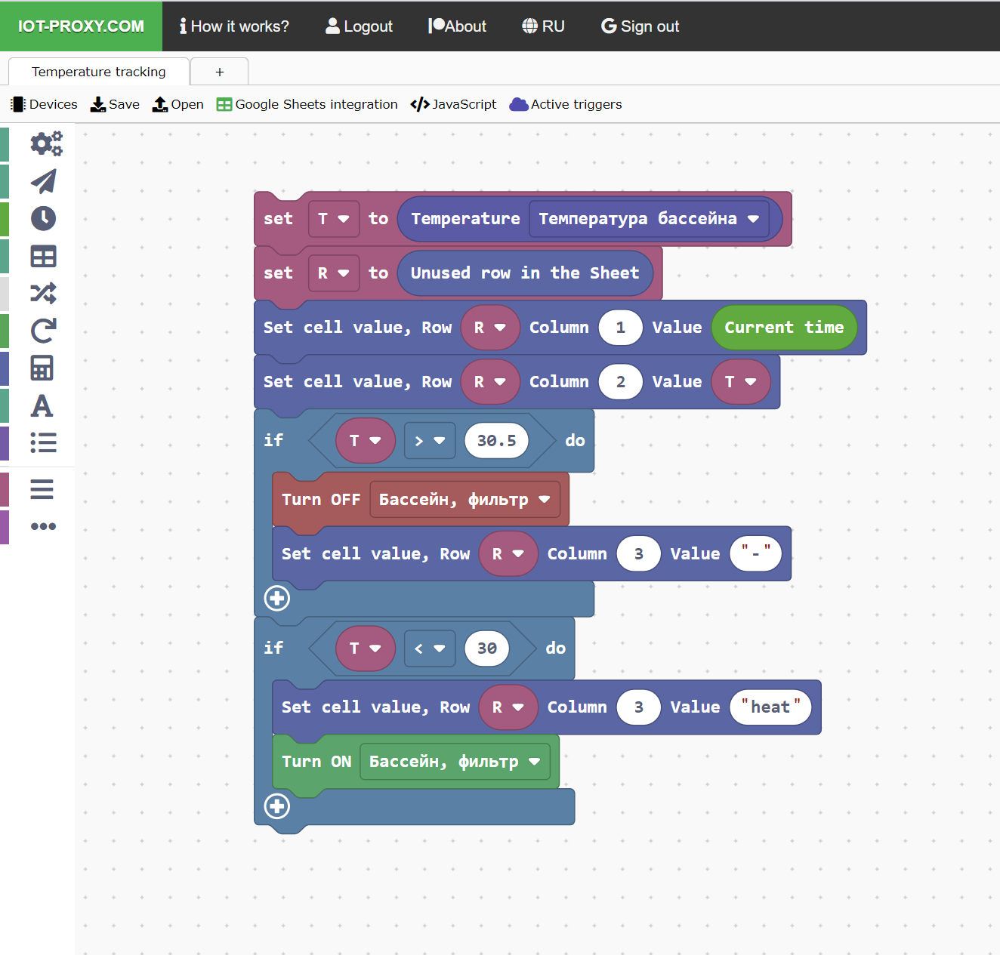

# eWeLink-blockly
The visual management of the eWeLink devices using the Google blockly. Create a script using blockly and deploy it to your google sheets/app scripts.

## The problem it solves

Yo have multiple eWeLink devices. This app allows devices management using the skretch-like UI. 
The app creates and deploys the Google sheet and Google app script that manages your eWeLink devices. No flashing required.

## How  to use?

Just go to https://iot-proxy.com, it is easy-to-use and well documented.

